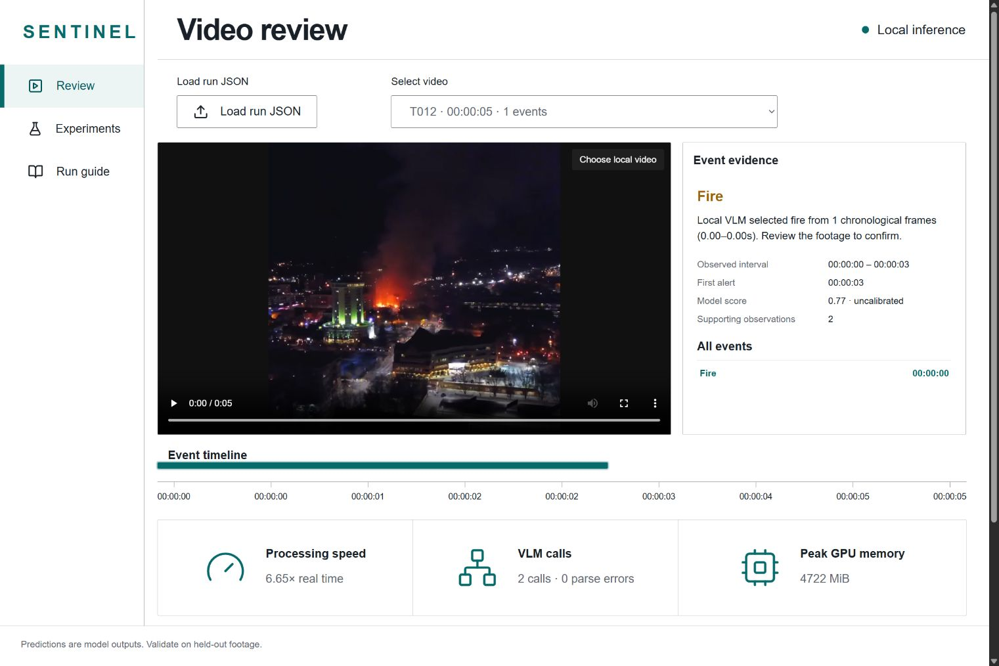
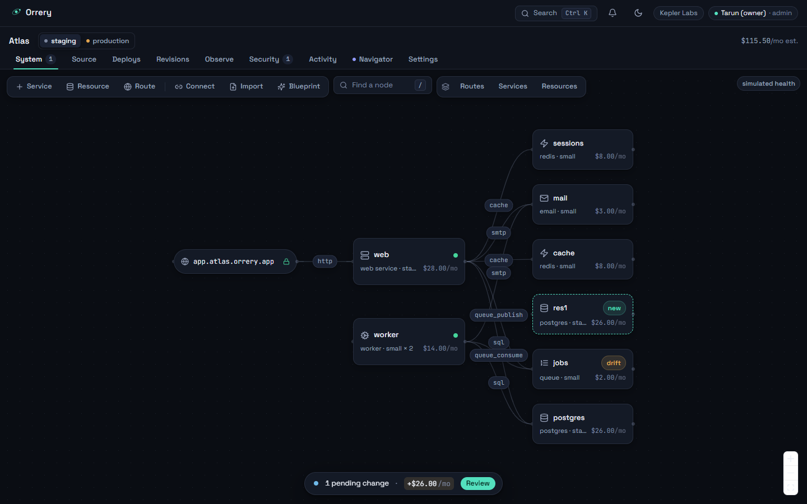
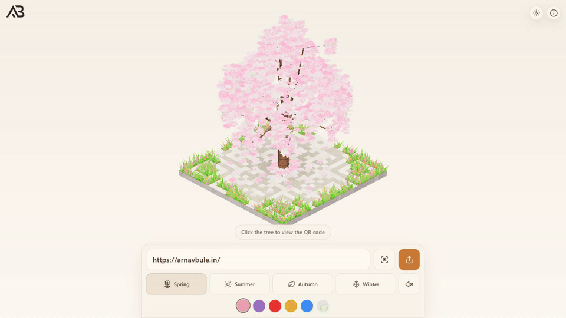
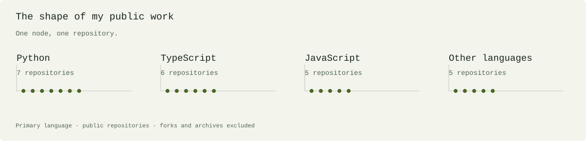

<!--
THESIS: A builder's terminal opens onto real, inspectable work. Projects carry the story.
OWN-WORLD: Graphite and warm paper, moss-green signal paths, strong lettering and plain-language project notes.
STORY: Meet Arnav, inspect three working projects, follow their source and recent releases.
FIRST VIEWPORT: Full-width original identity, a compact introduction and direct links, then the first project. Mobile recomposes the artwork.
FORM: Developer terminal with original branching geometry.
Generated by scripts/render_profile.py. Edit profile.config.json; do not edit generated content.
-->

<picture>
  <source media="(max-width: 600px) and (prefers-color-scheme: dark)" srcset="assets/generated/hero-mobile-dark.svg">
  <source media="(max-width: 600px)" srcset="assets/generated/hero-mobile-light.svg">
  <source media="(prefers-color-scheme: dark)" srcset="assets/generated/hero-dark.svg">
  
</picture>

<strong>I build practical AI systems and interactive web experiences.</strong> 

Local models, visual infrastructure, and the occasional idea that grows into a tree.

<a href="https://arnavbule.in">Portfolio ↗</a> &nbsp; / &nbsp; <a href="#selected-work">Selected work&nbsp;↓</a> &nbsp; / &nbsp; <a href="https://github.com/GODOSTROYER?tab=repositories">All repositories ↗</a>

<h2>Selected work</h2>

<h3>Sentinel — Local AI, with evidence</h3>

A local video anomaly detection pipeline combining CLIP, Qwen3-VL and temporal evidence. The review dashboard puts detections, event timelines and supporting evidence in one place.

<code>Python</code> &nbsp; <code>PyTorch</code> &nbsp; <code>OpenCV</code> &nbsp; <code>Qwen3-VL</code>

<a href="https://github.com/GODOSTROYER/sentinel-vad">Explore the code ↗</a> &nbsp; · &nbsp; <a href="https://github.com/GODOSTROYER/sentinel-vad/releases/tag/hackathon-polished">Get the release ↗</a>

 

<h3>Zenith.ai — Infrastructure, in view</h3>

A visual workspace for mapping systems, reviewing deployment plans and exporting Terraform. Make the relationships in a stack easier to see and reason about.

<code>TypeScript</code> &nbsp; <code>Next.js</code> &nbsp; <code>React</code> &nbsp; <code>Tailwind CSS</code>

<a href="https://orrery-three-kappa.vercel.app">Open the demo ↗</a> &nbsp; · &nbsp; <a href="https://github.com/GODOSTROYER/zenith">Explore the code ↗</a>

Sandbox operations are simulated; the AWS workflow provides plans and exports.

 

<h3>QR Tree Studio — A QR code that grows</h3>

<a href="https://qr-tree-studio.vercel.app"><picture><source media="(prefers-reduced-motion: reduce)" srcset="assets/projects/qr-tree.jpg"></picture></a>

Turn a URL into a scannable voxel tree. Explore seasonal themes, tune the palette and switch to a top-down QR view in an interactive 3D canvas.

<code>JavaScript</code> &nbsp; <code>React</code> &nbsp; <code>Vite</code> &nbsp; <code>WebGPU</code>

<a href="https://qr-tree-studio.vercel.app">Open the demo ↗</a> &nbsp; · &nbsp; <a href="https://github.com/GODOSTROYER/qr-tree-studio">Explore the code ↗</a>

Built with the open-source magic-tree-qr rendering engine.

 

<h2>From the workbench</h2>

<strong>Latest releases</strong>

<ul>

<li><a href="https://github.com/GODOSTROYER/sentinel-vad/releases/tag/hackathon-polished">sentinel-vad / hackathon-polished</a> — 05 Sep 2026</li>

</ul>

<strong>Recent public activity</strong>

<ul>

<li><a href="https://github.com/GODOSTROYER/sentinel-vad">sentinel-vad — Pushed to sentinel-vad</a> (05 Sep 2026)</li>

<li><a href="https://github.com/GODOSTROYER/arnav-portfolio-2025">arnav-portfolio-2025 — Pushed to arnav-portfolio-2025</a> (03 Sep 2026)</li>

<li><a href="https://github.com/GODOSTROYER/qr-tree-studio">qr-tree-studio — Pushed to qr-tree-studio</a> (02 Sep 2026)</li>

</ul>

Last refreshed 06 Sep 2026 · from public GitHub activity.

<picture>
  <source media="(max-width: 600px) and (prefers-color-scheme: dark)" srcset="assets/generated/work-map-mobile-dark.svg">
  <source media="(max-width: 600px)" srcset="assets/generated/work-map-mobile-light.svg">
  <source media="(prefers-color-scheme: dark)" srcset="assets/generated/work-map-dark.svg">
  
</picture>

A few more things I’ve built

 

<ul>

<li><a href="https://github.com/GODOSTROYER/HSN-Classifier-LLM">HSN Classifier</a> — product classification with retrieval-augmented generation.</li>

<li><a href="https://github.com/GODOSTROYER/task-tracker">Task Tracker</a> — a full-stack task app with Next.js, Express, MongoDB, and Redis.</li>

<li><a href="https://github.com/GODOSTROYER/zillow-medallion-databricks">Zillow Medallion</a> — data engineering with Databricks.</li>

</ul>

 

<strong>Have something interesting in mind?</strong> <a href="https://arnavbule.in">Find me at arnavbule.in ↗</a> &nbsp; · &nbsp; <a href="https://github.com/GODOSTROYER">Explore my GitHub ↗</a>

